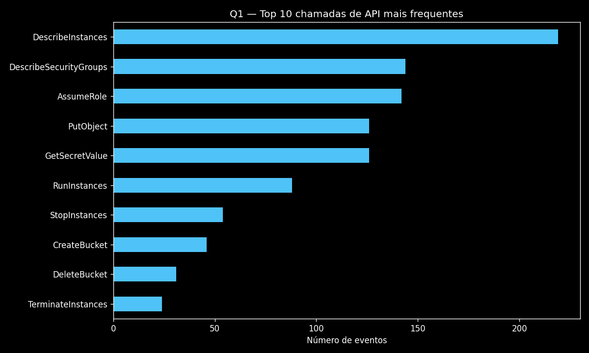
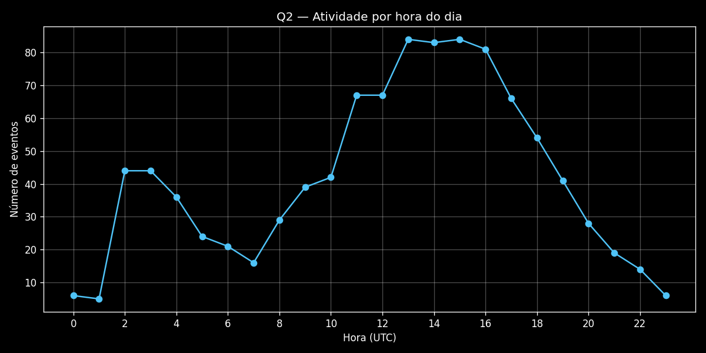
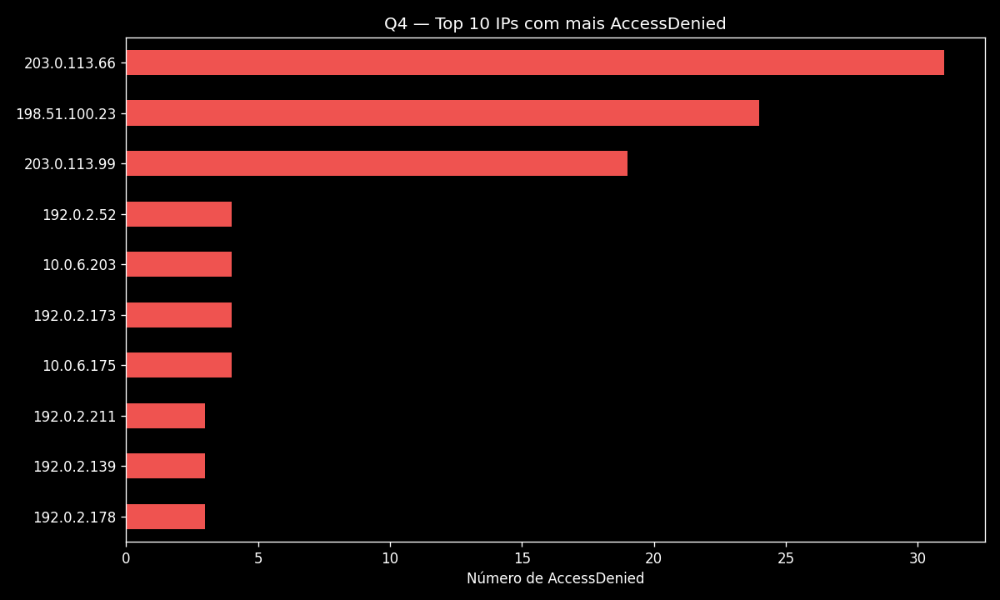
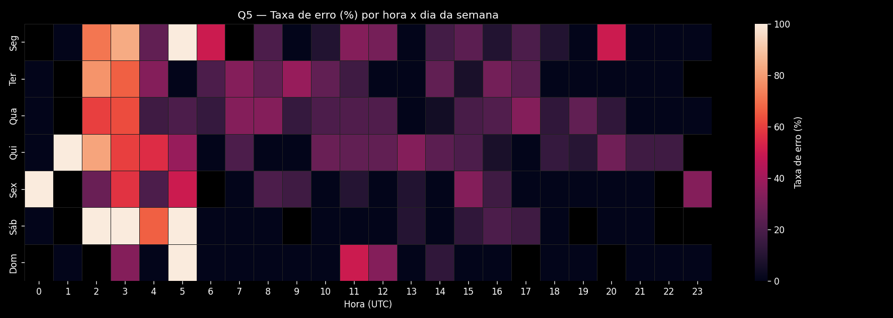

# projeto1-eda — Análise Exploratória de Logs AWS CloudTrail

Projeto de **EDA (Exploratory Data Analysis)** sobre 1000 eventos sintéticos simulando
logs do AWS CloudTrail — parte do meu portfólio de estudos de IA aplicada a infraestrutura.

## O que este projeto demonstra

- **EDA completa**: da geração do dado bruto até insights acionáveis
- **Python para dados**: pandas, numpy, matplotlib e seaborn
- **Visualização de dados**: 5 gráficos (barras, linha, heatmap) com tema escuro
- **Análise de dados de infraestrutura**: leitura de logs CloudTrail com olhar de
  segurança e operações (detecção de anomalias, padrões de uso de API)
- **Engenharia de software**: código testado (pytest), reproduzível (seed fixa),
  automatizado (Makefile) e com versão CLI independente do notebook

## Estrutura

```
projeto1-eda/
├── data/
│   ├── generate_data.py        # gera 1000 eventos sintéticos de CloudTrail
│   └── cloudtrail_sample.csv   # dataset (gerado por `make data`)
├── notebooks/
│   └── eda_cloudtrail.ipynb    # análise interativa com explicações
├── src/
│   └── analysis.py             # mesmas 5 análises em versão CLI
├── reports/                    # saída: 5 PNGs + summary.json (gerado)
├── tests/
│   └── test_analysis.py        # 5 testes (geração, métricas, gráficos)
├── requirements.txt
├── Makefile
└── README.md
```

## Como rodar

```bash
make all        # venv + dados + análises + testes (tudo de uma vez)
```

Ou por etapa:

```bash
make data       # gera data/cloudtrail_sample.csv (1000 eventos)
make analysis   # roda as 5 análises → reports/*.png + reports/summary.json
make test       # roda a suíte pytest
make clean      # remove artefatos gerados
```

Equivalente sem Makefile:

```bash
python src/analysis.py --output reports/
```

## As 5 perguntas respondidas

| # | Pergunta | Gráfico |
|---|----------|---------|
| Q1 | Top 10 chamadas de API mais frequentes | `q1_top_api_calls.png` |
| Q2 | Horas do dia com mais atividade | `q2_atividade_por_hora.png` |
| Q3 | Percentual de erros (global e por tipo) | `q3_taxa_erros.png` |
| Q4 | IPs com mais erros AccessDenied | `q4_top_ips_accessdenied.png` |
| Q5 | Correlação hora × dia da semana na taxa de erro | `q5_heatmap_hora_dia.png` |

### Exemplos de saída









### summary.json

```json
{
  "total_events": 1000,
  "error_rate_pct": 20.6,
  "top_api_call": "DescribeInstances",
  "peak_hour": 11,
  "unique_ips": 33,
  "most_common_error": "AccessDenied"
}
```

## Principais achados

1. **Leituras dominam o volume de API** — `DescribeInstances` lidera com 212 eventos,
   seguida de `AssumeRole` (148) e `GetSecretValue` (141). É o perfil esperado de uma
   conta saudável: ferramentas de monitoramento e IaC fazem muito mais leitura do que escrita.

2. **Três IPs concentram os `AccessDenied`** — os IPs `203.0.113.66` (41 erros),
   `198.51.100.23` (19) e `203.0.113.99` (16) respondem por **54% de todos os
   AccessDenied** da conta, mirando principalmente `GetSecretValue` e `AssumeRole`.
   Em produção, esse padrão indicaria credencial vazada sendo testada — ação imediata:
   revogar as credenciais e bloquear os IPs.

3. **A madrugada tem 4x mais erros que o horário comercial** — a taxa de erro entre
   2h e 5h é de **55,8%**, contra **13,1%** entre 9h e 18h. Os erros não acompanham o
   volume de uso normal: há uma fonte de falhas independente da atividade legítima,
   visível no heatmap da Q5. Próximo passo em cenário real: alarme no CloudWatch para
   rajadas de `AccessDenied` por IP fora do horário comercial.

## Stack

`Python 3.12` · `pandas` · `numpy` · `matplotlib` · `seaborn` · `pytest` · `make`

> **Nota sobre os dados**: os eventos são sintéticos (gerados com seed fixa para
> reprodutibilidade), com padrões de anomalia injetados de propósito — IPs nos blocos
> de documentação RFC 5737 (`203.0.113.0/24`, `198.51.100.0/24`, `192.0.2.0/24`).
